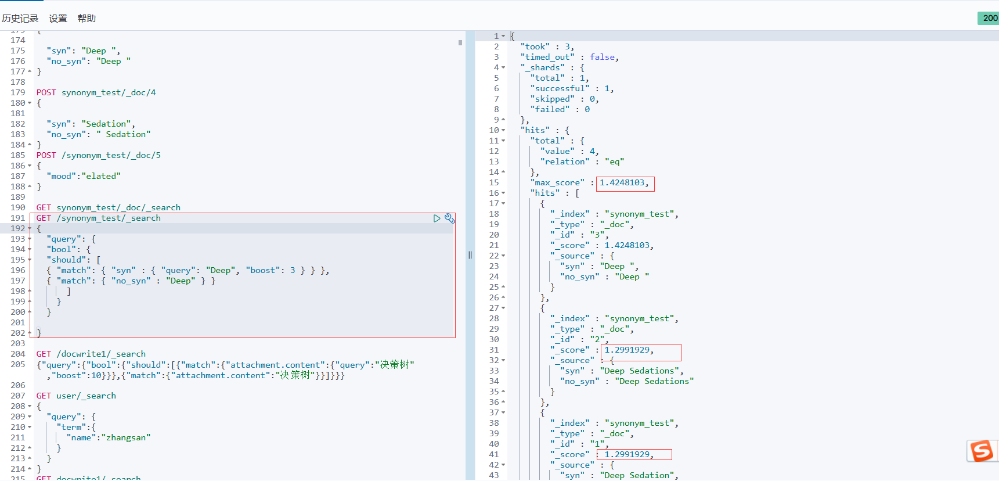
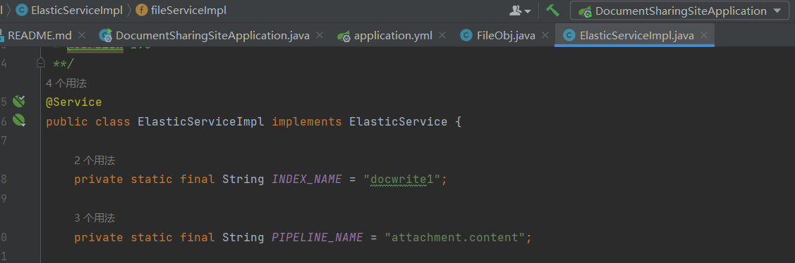

#### 同义词设置

* es配置

在es的config目录下新建analysis文件夹，在文件夹里新建文本文件synonyms.txt

在其中添加如下内容：

```
$ pwd
/etc/elasticsearch/analysis
liuxg:analysis liuxg$ cat synonyms.txt 
"china, silk road, chn, PRC, People's Republic of China",
"elk, elastic stack"
"Deep Sedation,Deep Sedations,Sedations, Deep,Sedation, Deep"
```

其中每一行定义了同义词格式如上，修改完重启es

注：现在配置的mesh同义词太多会导致kibana闪退，head也打不开，es可能也会出问题，还在找解决方法

1. ##### 对synonym_test索引进行定义

###### 解决同义词得分比原词高的问题：

由于同义词被es认为是相同的词，则更长的词被搜到的得分会高一些，比如搜索deep但是他的同义词Deep Sedation的得分更高

解决方法：设置两个analyzer（no_synonyms和synonyms），一个没用同义词搜索，一个使用同义词搜索，最终取两个 analyzer的共同得分，最终原词的得分一定是最高的，不会受到同义词长度的影响

在kibana中运行，对synonym_test索引进行配置（synonym_test必须为一个未创建的索引名）

```json
PUT /synonym_test/
{
  "settings": {
    "analysis": {
      "analyzer": {
        "no_synonyms": {
          "type": "custom",
          "tokenizer": "ik_smart"
        },
        "synonyms": {
         "type": "custom",
          "tokenizer": "ik_smart",
          "filter": [
            "synonym"
          ]
        }
      },
      "filter": {
        "synonym": {
          "type": "synonym",
          "synonyms_path": "analysis/synonyms.txt",
          "ignore_case": true,
		  "format": "word1, word2, {} => {}"
        }
      }
    }
  },
  "mappings": {
    "properties": {
      "syn": {
        "type": "text",
        "analyzer": "synonyms"
      },
      "no_syn": {
        "type": "text",
        "analyzer": "no_synonyms"
      }
    }
  }
}
```

2. ##### 向索引中添加测试内容

分别向syn和no_syn两个字段中添加文本，在第一步配置mapping中我们为这两个字段设置了两个不同的analyzer

```json
POST synonym_test/_doc/1
{
  "syn": "Deep Sedation",
  "no_syn": "Deep Sedation"
}
POST synonym_test/_doc/2
{
  "syn": "Deep Sedations",
  "no_syn": "Deep Sedations"
}
POST synonym_test/_doc/3
{
  
  "syn": "Deep ",
  "no_syn": "Deep "
}

POST synonym_test/_doc/4
{

  "syn": "Sedation",
  "no_syn": " Sedation"
}
```

3. ##### 查询

```json
GET /synonym_test/_search
{
  "query": {
    "bool": {
      "should": [
          { "match": { "syn" : { "query": "Deep", "boost": 3 } } },
          { "match": { "no_syn" : "Deep" } }
      ]
    }
  }
}
```

在syn和no_syn两个字段进行查找，设置权重，最终得到两个字段的综合得分如下，deep的得分最高排在前面，成功解决同义词得分高于原词的问题：




##### 应用于我们的项目思路



* 我们的项目只将文本存入一个attachment.content字段中，按照上述方法需要再定义一个字段，将文本上传到两个字段中保存；并且按照上面的方法对两个子段设置不同的analyzer，即将第一步的mapping中的syn和no_syn改成我们存储文本的字段，这一步在kibana中配置就行了

* 我们的项目原来的docwrite已经存在，因此配置新索引要换个名字

* 文本上传到两个字段
* 用QueryBuilders.multiMatchQuery()多字段搜索，对两个字段进行搜索并赋予不同的权重

 


